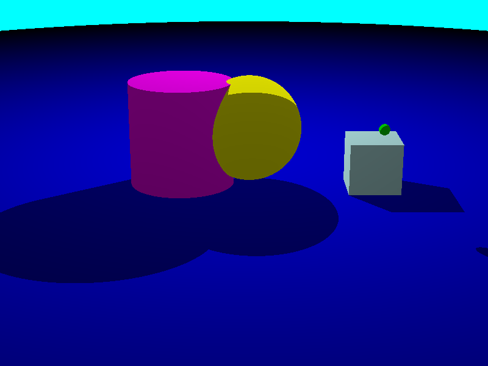

# Task "rt"
grit:lab Åland Islands 2023

<p align="center">
    
</p>

## Build
```
./do
```

## Run
```
./we [camera file] [light file] [objects file]
```
**ONE camera file, ONE light file and ONE objects file are required condition.**  
The order of the files in terminal command is important.  
**Only ONE camera , ONE light, and multiple objects are allowed on scene.**
To create scene, create files with description of camera, light and objects.  
Then use them as arguments of the program.  
**Name all files without extension.**

## Example
```
./we use/camera1 use/light1 use/objects1
```

## Camera file example . The comments after `#` are ignored
```
# the "800 600 output_file" is result image:
# [width in pixels] [height in pixels] [output file name without extension]
# Output file name must contain only English letters, Arabic numbers, and underscores. No spaces.
# You should use positive integer values, for [width in pixels] and [height in pixels], otherwise, think about visit psychiatrist.

# [zoom] - a distance against the camera vector (from camera position)
# tiny zoom value will make panorama view
# You should use positive integer value ... 🥹

# [from] - x y z coordinates of the camera (center of rectangle area of pixels)
# in simple words, it is the position of the camera in the global coordinates
# think about it like about the center of the screen of the camera(rectangle area of pixels)
# You should use integer values ... 🥹

# [to] - x y z coordinates of the point the camera is looking at. To build vector.
# Perpendicular vector of the camera direction(from the center of camera screen)
# will be built from the camera position to this point.
# You should use integer values ... 🥹

# [up] - x y z coordinates of the end of up vector of the camera. To build vector.
# Vector will be built from the zero 0 0 0 of the global coordinates to this point.
# Not sure what to use? Try 0 1 0. It is the vertical vector of the global coordinates.
# You should use integer values ... 🥹

# The [from] and [to] must not be the same point. 
# The [up] and [to] must not be on the same line(based on positions [from] and [to]).
# Do not know how to check it? Use example from this file.
# Otherwise, do not expect the correct result.

# To move the camera and rotate it, just change the camera position.  
# Direction will be the same, so camera will be rotated.

800 600 pre
zoom 1500
from 0 100 300
to 0 0 0
up 0 1 0
```

## Light file example . The comments after `#` are ignored
```
# A point light custom implementation with brightness control.

# [power] - how long distance the light will affect objects.
# You should use positive integer value, otherwise, think about visit psychiatrist.

# [color] - r g b color of the light source in range 0-255.
# Properly decrease all the components to decrease the brightness of the resulting image.

# [from] - x y z coordinates of the light source(where the lamp placed)
# You should use integer values ... 🥹

power 2000
color 255 255 255
from 0 400 -200

```

## Objects file example . The comments after `#` are ignored
```
# general sequence is [color] [type] [properties] .

# [color] - r g b color of the light source in range 0-255.

# [type] - [ball] or [box] or [roll] or [mat].

# [coordinates] - x y z coordinates of the object position in the global coordinates.
# You should use integer values ... 🥹

# The order of parts of the line of the object description is important.
# One line one object.

# Type "ball" - it is like a short name of the sphere.
# [color] ball [coordinates] [radius]
# - [coordinates] - x y z coordinates of the center of the sphere.
# - [radius] - radius of the sphere. You should use positive integer value ... 🥹

# Type "box" - it is like a short name of the cube.
# [color] box [coordinates] [size]
# - [coordinates] - x y z coordinates of the center of the cube.
# - [size] - lentgh of the edge. You should use positive integer value ... 🥹

# Type "roll" - it is like short name of the cylinder.
# The height will be placed parallel to the y axis,
# which was choosen as the vertical axis.
# [color] roll [coordinates] [radius] [height]
# - [coordinates] - x y z coordinates of the center of the cylinder.
# - [radius] - radius of the cylinder. You should use positive integer value ... 🥹
# - [height] - height of the cylinder. You should use positive integer value ... 🥹

# Type "mat" - it is like short name of the flat plane.
# [color] mat [coordinates] [normal vector coordinates]
# - [coordinates] - x y z coordinates of the origin position of the plane.
# - [normal vector coordinates] - x y z coordinates of the end of the normal vector of the plane(vector will be started from zero point of the global coordinates).

0 0 255 mat 0 0 0 0 100 0
0 255 0 ball 250 150 150 10
255 255 0 ball 10 120 25 100
200 255 255 box 250 50 25 100
255 0 255 roll -120 110 20 100 200
```

## Description
https://github.com/01-edu/public/tree/master/subjects/rt

## Authors
- [healingdrawing](https://healingdrawing.github.io)